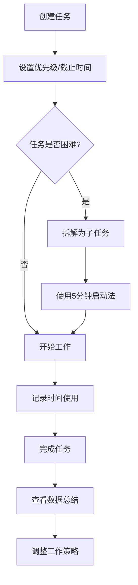

## 1. Product Overview

Do it!是一款基于心理学原理的抗拖延日程管理应用，通过任务拆解、四象限管理、5分钟启动法等科学方法帮助用户战胜拖延，养成高效工作习惯。目标用户主要为大学生、职场人士和自由职业者。

## 2. Core Features

### 2.1 User Roles

| Role        | Registration Method       | Core Permissions                    |
| ----------- | ------------------------- | ----------------------------------- |
| Normal User | Email/Google registration | Create tasks, use all core features |

### 2.2 Feature Module

1. **Dashboard**: 任务概览、四象限视图、今日待办
2. **Task Management**: 任务创建、拆解、优先级设置
3. **Time Tracker**: 时间记录、拖延分析
4. **Psychological Tools**: 5分钟启动法、拖延诊断、认知重评
5. **Analytics**: 日/周/月/年数据可视化总结

### 2.3 Page Details

| Page Name           | Module Name               | Feature description |
| ------------------- | ------------------------- | ------------------- |
| Dashboard           | Task Overview             | 四象限任务展示、今日进度、快速添加任务 |
| Dashboard           | Quick Actions             | 一键启动5分钟工作、查看今日统计    |
| Task Management     | Task List                 | 任务列表、筛选、搜索          |
| Task Management     | Task Detail               | 任务详情、拆解子任务、设置优先级    |
| Time Tracker        | Timer                     | 计时功能、时间分类记录         |
| Time Tracker        | Analysis                  | 拖延时间分析、时间使用报告       |
| Psychological Tools | Procrastination Diagnosis | 拖延原因测试、个性化建议        |
| Psychological Tools | Cognitive Reframing       | 完美主义思维转换引导          |
| Psychological Tools | 5-Minute Start            | 启动倒计时、激励文案          |
| Analytics           | Summary                   | 日/周/月/年数据可视化图表      |

## 3. Core Process

用户创建任务 → 设置优先级（四象限）→ 拆解困难任务 → 使用5分钟启动法开始 → 记录时间使用 → 查看数据总结 → 调整工作习惯

## 4. User Interface Design

### 4.1 Design Style

* **Primary Color**: #6366f1 (Indigo) - 代表专注和智慧

* **Secondary Colors**: #10b981 (Emerald) - 完成状态, #f59e0b (Amber) - 提醒/警告, #ef4444 (Red) - 紧急任务

* **Button Style**: 圆角(12px), 渐变效果, 悬停放大动画

* **Font**: Inter (现代简洁)

* **Layout**: 卡片式布局, 左侧导航

* **Icon Style**: 简洁线性图标

### 4.2 Page Design Overview

| Page Name           | Module Name    | UI Elements                  |
| ------------------- | -------------- | ---------------------------- |
| Dashboard           | Quadrant View  | 四象限卡片网格、颜色编码、任务计数            |
| Dashboard           | Today Progress | 进度圆环、完成百分比、激励文字              |
| Task Management     | Task Card      | 任务标题、截止日期、优先级标签、操作按钮         |
| Time Tracker        | Timer Display  | 大数字显示、开始/暂停按钮、时间分类选择         |
| Psychological Tools | Diagnosis Form | 问题列表、滑动选择器、结果展示卡片            |
| Analytics           | Charts         | 折线图(完成趋势)、饼图(时间分配)、柱状图(任务类型) |

### 4.3 Responsiveness

* **Desktop**: 左侧导航栏 + 右侧主内容区

* **Tablet**: 顶部导航 + 主内容区

* **Mobile**: 底部标签栏导航、触控友好按钮

### 4.4 Accessibility

* 键盘导航支持

* 屏幕阅读器兼容

* 颜色对比度符合WCAG标准

* 响应式字体大小

