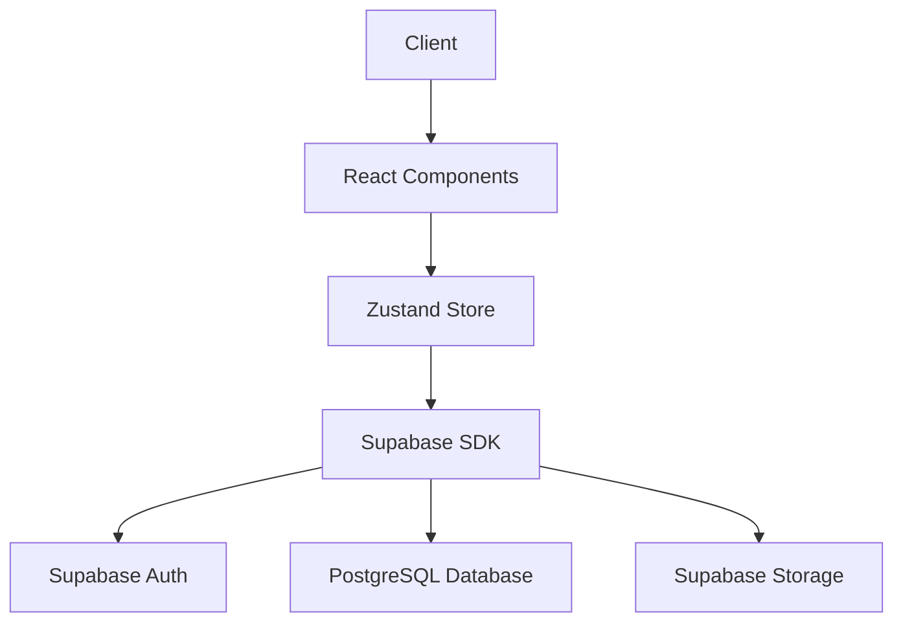
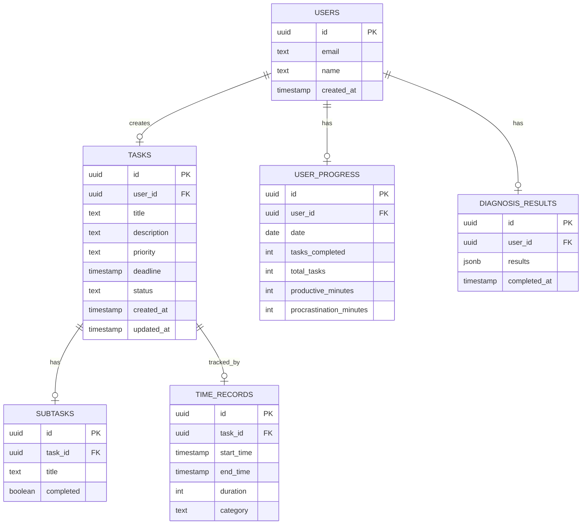

## 1. Architecture Design
```mermaid
flowchart TB
    subgraph Frontend["React Frontend"]
        A[Dashboard Page]
        B[Task Management]
        C[Time Tracker]
        D[Psychological Tools]
        E[Analytics]
    end
    
    subgraph State Management["Zustand Store"]
        F[Task Store]
        G[Timer Store]
        H[User Store]
    end
    
    subgraph Backend["Supabase"]
        I[Authentication]
        J[Database]
        K[Storage]
    end
    
    Frontend --> State Management
    State Management --> Backend
```

## 2. Technology Description
- **Frontend**: React@18 + TypeScript + TailwindCSS@3 + Vite
- **Initialization Tool**: vite-init
- **State Management**: Zustand
- **Routing**: React Router DOM
- **Icons**: Lucide React
- **Charts**: Chart.js + react-chartjs-2
- **Backend**: Supabase (Authentication, Database, Storage)

## 3. Route Definitions
| Route | Purpose | Component |
|-------|---------|-----------|
| `/` | Dashboard with quadrant view | Dashboard.tsx |
| `/tasks` | Task list and management | TaskList.tsx |
| `/tasks/:id` | Task detail and subtasks | TaskDetail.tsx |
| `/timer` | Time tracking interface | Timer.tsx |
| `/tools` | Psychological tools (diagnosis, reframing) | Tools.tsx |
| `/analytics` | Data visualization summary | Analytics.tsx |
| `/settings` | User settings and profile | Settings.tsx |

## 4. API Definitions
### 4.1 Task Schema
```typescript
interface Task {
  id: string;
  title: string;
  description: string;
  priority: 'urgent-important' | 'important-not-urgent' | 'urgent-not-important' | 'not-urgent-not-important';
  deadline: Date;
  status: 'pending' | 'in-progress' | 'completed';
  subtasks: Subtask[];
  createdAt: Date;
  updatedAt: Date;
}

interface Subtask {
  id: string;
  title: string;
  completed: boolean;
}
```

### 4.2 TimeRecord Schema
```typescript
interface TimeRecord {
  id: string;
  taskId: string;
  startTime: Date;
  endTime: Date;
  duration: number; // minutes
  category: 'work' | 'procrastination' | 'break' | 'learning';
}
```

### 4.3 UserProgress Schema
```typescript
interface UserProgress {
  userId: string;
  date: Date;
  tasksCompleted: number;
  totalTasks: number;
  productiveMinutes: number;
  procrastinationMinutes: number;
}
```

## 5. Server Architecture Diagram


## 6. Data Model
### 6.1 Data Model Definition


### 6.2 Data Definition Language
```sql
-- Users Table
CREATE TABLE users (
    id UUID PRIMARY KEY DEFAULT uuid_generate_v4(),
    email TEXT UNIQUE NOT NULL,
    name TEXT,
    created_at TIMESTAMP DEFAULT CURRENT_TIMESTAMP
);

-- Tasks Table
CREATE TABLE tasks (
    id UUID PRIMARY KEY DEFAULT uuid_generate_v4(),
    user_id UUID REFERENCES users(id),
    title TEXT NOT NULL,
    description TEXT,
    priority TEXT NOT NULL CHECK (priority IN ('urgent-important', 'important-not-urgent', 'urgent-not-important', 'not-urgent-not-important')),
    deadline TIMESTAMP,
    status TEXT DEFAULT 'pending' CHECK (status IN ('pending', 'in-progress', 'completed')),
    created_at TIMESTAMP DEFAULT CURRENT_TIMESTAMP,
    updated_at TIMESTAMP DEFAULT CURRENT_TIMESTAMP
);

-- Subtasks Table
CREATE TABLE subtasks (
    id UUID PRIMARY KEY DEFAULT uuid_generate_v4(),
    task_id UUID REFERENCES tasks(id),
    title TEXT NOT NULL,
    completed BOOLEAN DEFAULT false
);

-- Time Records Table
CREATE TABLE time_records (
    id UUID PRIMARY KEY DEFAULT uuid_generate_v4(),
    task_id UUID REFERENCES tasks(id),
    start_time TIMESTAMP NOT NULL,
    end_time TIMESTAMP,
    duration INT,
    category TEXT CHECK (category IN ('work', 'procrastination', 'break', 'learning'))
);

-- User Progress Table
CREATE TABLE user_progress (
    id UUID PRIMARY KEY DEFAULT uuid_generate_v4(),
    user_id UUID REFERENCES users(id),
    date DATE NOT NULL,
    tasks_completed INT DEFAULT 0,
    total_tasks INT DEFAULT 0,
    productive_minutes INT DEFAULT 0,
    procrastination_minutes INT DEFAULT 0
);

-- Diagnosis Results Table
CREATE TABLE diagnosis_results (
    id UUID PRIMARY KEY DEFAULT uuid_generate_v4(),
    user_id UUID REFERENCES users(id),
    results JSONB,
    completed_at TIMESTAMP DEFAULT CURRENT_TIMESTAMP
);

-- Indexes
CREATE INDEX idx_tasks_user_id ON tasks(user_id);
CREATE INDEX idx_tasks_status ON tasks(status);
CREATE INDEX idx_time_records_task_id ON time_records(task_id);
CREATE INDEX idx_user_progress_user_date ON user_progress(user_id, date);
```

## 7. Security
- JWT-based authentication via Supabase
- Row-level security (RLS) enabled on all tables
- HTTPS only communication
- Password hashing handled by Supabase Auth
- Sensitive data encrypted at rest