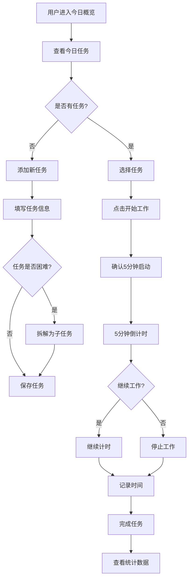
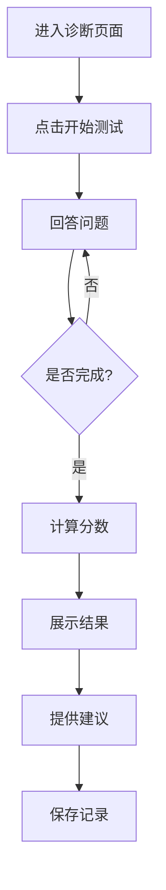
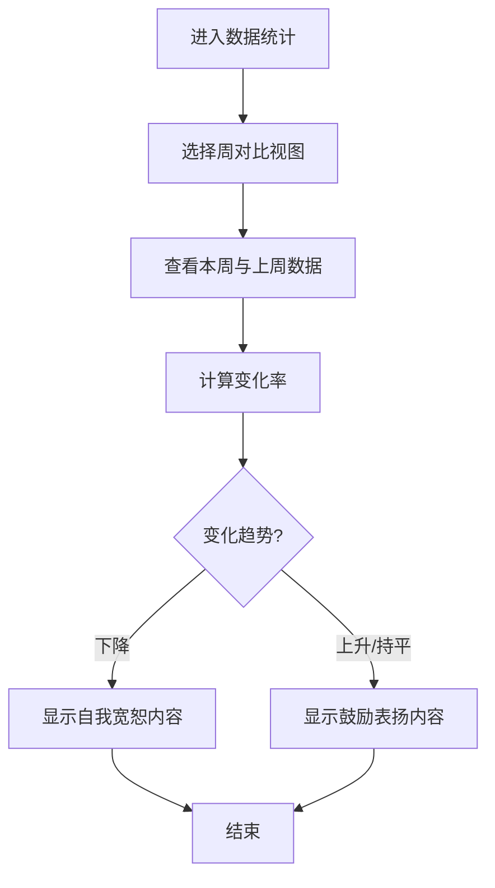

# Do it! 产品需求文档（PRD）

---

## 1. 产品概述

### 1.1 产品定位
**Do it!** 是一款基于心理学原理的抗拖延日程管理应用，通过任务拆解、四象限管理、5分钟启动法、拖延诊断等科学方法帮助用户战胜拖延，养成高效工作习惯。

### 1.2 目标用户
| 用户群体 | 年龄范围 | 核心需求 |
|---------|---------|---------|
| 大学生 | 18-24岁 | 学业任务管理、克服拖延、提升学习效率 |
| 职场人士 | 25-35岁 | 多任务处理、时间管理、压力缓解 |
| 自由职业者/创作者 | 25-40岁 | 创作灵感激发、自律养成、工作习惯建立 |

### 1.3 用户画像
**用户1：小王（大学生）**
- 基本信息：19岁，计算机专业大二学生
- 典型场景：面对课程作业、小组汇报、课程论文等事项无从下手，常常拖到最后阶段
- 核心痛点：缺乏学习动力，任务优先级不清晰

**用户2：小张（互联网运营）**
- 基本信息：28岁，互联网公司运营经理
- 典型场景：周报、会议PPT、方案设计等工作应接不暇，压力巨大
- 核心痛点：任务过载，难以平衡工作与学习

**用户3：小李（自媒体创作者）**
- 基本信息：32岁，自媒体博主
- 典型场景：难以产生创作灵感，在娱乐项目上浪费大量时间
- 核心痛点：完美主义倾向，害怕失败而不愿开始

### 1.4 产品愿景
成为用户最信赖的抗拖延伙伴，通过科学的心理学方法帮助用户建立高效工作习惯，实现个人成长与职业发展。

---

## 2. 核心功能模块

### 2.1 任务管理模块
| 功能点 | 功能描述 | 需求来源 |
|-------|---------|---------|
| 任务创建 | 支持添加标题、描述、重要性、难度、截止日期（含长期选项） | 用户痛点：任务项数不明确 |
| 任务拆解 | 将困难任务拆解为子任务 | 心理学理论：行为激活与目标梯度效应 |
| 四象限视图 | 按重要/紧急自动分类展示任务 | 时间管理理论 |
| 任务状态管理 | 待处理/进行中/已完成状态切换 | 基础任务管理需求 |
| 任务导入 | 支持从外部文件导入任务 | 用户反馈需求 |
| 日常任务 | 支持创建重复性任务（每日/工作日/自定义） | 用户反馈需求 |

### 2.2 时间追踪模块
| 功能点 | 功能描述 | 需求来源 |
|-------|---------|---------|
| 5分钟启动法 | 强制5分钟倒计时，不可暂停或提前终止，5分钟后可选择继续或停止 | 心理学理论：5分钟规则 |
| 事件记录 | 24小时时间线显示，自动记录工作时长 | 用户痛点：时间浪费不明确 |
| 手动记录 | 允许用户添加未使用app记录的时间 | 用户反馈需求 |
| 时段分类 | 不同颜色标注不同类型的时间记录 | 可视化需求 |

### 2.3 拖延诊断模块
| 功能点 | 功能描述 | 需求来源 |
|-------|---------|---------|
| 艾森克拖延量表 | 20道题目评估拖延倾向，涵盖决策拖延、回避拖延、唤醒拖延三个维度 | 心理学理论：艾森克人格问卷 |
| 诊断结果展示 | 显示总分、子维度分数、拖延程度评估 | 用户痛点：不知拖延原因 |
| 个性化建议 | 根据诊断结果提供针对性改进建议 | 用户需求：获得具体指导 |
| 历史记录 | 保存历次诊断结果，支持纵向对比 | 用户需求：追踪变化 |
| 自动提醒 | 首次登录和每周自动弹出诊断 | 用户体验优化 |

### 2.4 心理工具模块
| 功能点 | 功能描述 | 需求来源 |
|-------|---------|---------|
| 认知重评 | 将完美主义思维转换为理性思维，计时过程中显示 | 心理学理论：认知重构 |
| 自我宽恕 | 当工作时长下降时显示安抚内容 | 用户痛点：拖延后的自责 |
| 鼓励表扬 | 当工作时长提升时显示激励内容 | 心理学理论：自我效能感 |
| 拖延原因库 | 展示8种常见拖延原因及应对建议 | 用户需求：了解拖延机制 |

### 2.5 数据统计模块
| 功能点 | 功能描述 | 需求来源 |
|-------|---------|---------|
| 每日统计 | 今日任务完成情况、工作时长 | 基础数据需求 |
| 每周统计 | 一周任务趋势、周专注总时间、任务时长分布 | 用户反馈需求 |
| 周对比 | 本周与上周数据对比，显示变化率 | 用户反馈需求 |
| 可视化图表 | 折线图、柱状图展示数据 | 心理学理论：成就动机理论 |

### 2.6 日程模块
| 功能点 | 功能描述 | 需求来源 |
|-------|---------|---------|
| 日历视图 | 按日/周/月展示日程 | 用户反馈需求 |
| 颜色编码 | 按任务重要性和紧急程度显示颜色 | 四象限颜色体系统一 |
| 工作日/休息日区分 | 视觉上区分不同类型日期 | 用户体验优化 |
| 日常任务 | 支持创建重复性任务 | 用户反馈需求 |

---

## 3. 用户流程

### 3.1 核心任务流程

### 3.2 拖延诊断流程

### 3.3 周对比流程

---

## 4. 页面结构

### 4.1 页面列表
| 页面名称 | 路径 | 功能描述 |
|---------|------|---------|
| 今日概览 | `/` | 今日任务概览、开始工作入口、今日数据统计 |
| 任务管理 | `/tasks` | 任务列表、四象限视图、任务详情 |
| 事件记录 | `/timer` | 24小时时间线、时间记录管理 |
| 拖延诊断 | `/diagnosis` | 艾森克量表测试、诊断结果、历史记录 |
| 数据统计 | `/analytics` | 今日/本周/周对比数据可视化 |
| 日程 | `/calendar` | 日历视图、日常任务管理 |
| 设置 | `/settings` | 用户设置、数据管理 |

### 4.2 页面详细设计

#### 4.2.1 今日概览页面
| 模块 | 元素 | 功能 |
|-----|------|-----|
| 顶部导航 | 标题、日期、导入任务按钮、添加临时任务按钮 | 页面标识、快速操作 |
| 开始工作模块 | 主标题、副标题、开始按钮 | 5分钟启动入口 |
| 今日数据 | 工作时长统计 | 今日时间使用情况 |
| 今日待办 | 任务列表、完成操作 | 任务执行入口 |

#### 4.2.2 拖延诊断页面
| 视图 | 模块 | 元素 |
|-----|-----|-----|
| 欢迎页 | 介绍 | 量表说明、开始测试按钮 |
| 测试页 | 题目 | 20道题目，5分制评分 |
| 结果页 | 分数展示 | 总分、三个子维度分数 |
| 结果页 | 评估等级 | 低/轻度/中度/严重拖延 |
| 结果页 | 建议 | 针对性改进建议 |
| 历史记录 | 记录列表 | 历次诊断结果、变化对比 |
| 历史记录 | 趋势图表 | 可视化展示分数变化 |
| 常见原因 | 原因列表 | 8种拖延原因及应对建议 |

#### 4.2.3 数据统计页面
| 视图 | 模块 | 元素 |
|-----|-----|-----|
| 每日统计 | 统计卡片 | 总任务数、完成数、待处理数、专注时长 |
| 每日统计 | 任务状态分布 | 饼图展示 |
| 每日统计 | 今日时间记录 | 列表展示 |
| 每周统计 | 统计卡片 | 总任务数、完成数、待处理数、周专注时长 |
| 每周统计 | 每日任务趋势 | 折线图 |
| 每周统计 | 任务时长分布 | 柱状图 |
| 每周统计 | 任务时长概览 | 列表展示 |
| 周对比 | 统计卡片 | 上周时长、本周时长、变化率 |
| 周对比 | 对比图表 | 柱状图 |
| 周对比 | 心理引导 | 自我宽恕/鼓励表扬内容 |

---

## 5. UI设计规范

### 5.1 设计风格
- **主色调**: `#6366f1` (Indigo) - 代表专注和智慧
- **辅助色**: 
  - `#10b981` (Emerald) - 完成状态、正向反馈
  - `#f59e0b` (Amber) - 提醒、警告
  - `#ef4444` (Red) - 紧急任务、负向反馈
  - `#3b82f6` (Blue) - 信息展示
- **按钮风格**: 圆角(12px)、渐变效果、悬停放大动画
- **字体**: Inter（现代简洁）
- **布局**: 卡片式布局、左侧导航
- **图标风格**: 简洁线性图标（Lucide）

### 5.2 响应式设计
| 设备类型 | 布局方式 | 导航方式 |
|---------|---------|---------|
| 桌面端 | 左侧导航栏 + 右侧主内容区 | 侧边栏菜单 |
| 平板端 | 顶部导航 + 主内容区 | 顶部标签栏 |
| 移动端 | 单页布局 | 底部标签栏 |

### 5.3 交互规范
- 按钮点击反馈：缩放动画 + 颜色变化
- 页面切换：淡入淡出效果
- 卡片悬停：阴影加深 + 轻微上浮
- 任务完成：滑动动画 + 勾选效果
- 进度条：平滑过渡动画

---

## 6. 成功指标

### 6.1 行为指标
| 指标 | 测量方式 | 目标值 |
|-----|---------|-------|
| 任务按时完成率 | 后台统计截止时间与实际完成时间对比 | ≥80% |
| 5分钟启动使用率 | 统计用户使用5分钟启动法的频率 | ≥50% |
| 任务拆解使用率 | 统计用户拆解任务的比例 | ≥30% |
| 拖延诊断完成率 | 统计用户完成诊断的比例 | ≥40% |

### 6.2 心理指标
| 指标 | 测量方式 | 目标值 |
|-----|---------|-------|
| 拖延严重程度下降 | 使用艾森克拖延量表前后测对比 | ≥15% |
| 用户感知有用性 | 每周弹窗问卷（1-5分） | ≥4.2分 |

### 6.3 留存指标
| 指标 | 测量方式 | 目标值 |
|-----|---------|-------|
| 7日留存率 | 后台分析连续使用天数 | ≥40% |
| 30日留存率 | 后台分析连续使用天数 | ≥20% |

---

## 7. 版本规划

### 7.1 MVP版本（V1.0）
- 任务管理：任务创建、编辑、删除、状态切换
- 四象限视图：按重要/紧急自动分类
- 5分钟启动法：强制倒计时功能
- 基础统计：今日数据统计
- 数据持久化：本地存储

### 7.2 功能完善版本（V1.1）
- 任务拆解：支持子任务创建
- 时间记录：24小时时间线显示
- 心理工具：认知重评
- 每周统计：周数据汇总

### 7.3 拖延诊断版本（V1.2）
- 艾森克拖延量表测试
- 诊断结果与个性化建议
- 历史记录与纵向对比
- 常见拖延原因库
- 自动诊断提醒（首次登录/每周）

### 7.4 数据驱动版本（V1.3）
- 周对比功能：本周与上周数据对比
- 可视化图表：折线图、柱状图
- 自我宽恕/鼓励系统：根据数据自动触发
- 日常任务：重复性任务支持

### 7.5 社交版本（V2.0）
- 用户社区：经验分享、打卡互动
- 好友系统：互相监督、共同进步
- 成就系统：徽章、等级、排行榜
- 数据导出：支持多种格式导出

---

## 8. 运营与推广

### 8.1 用户增长策略
- **校园推广**：与高校合作，针对大学生群体进行推广
- **内容营销**：发布抗拖延相关的心理学文章、短视频
- **KOL合作**：邀请学习博主、职场达人进行产品推荐
- **应用商店优化**：优化ASO，提高搜索排名

### 8.2 用户留存策略
- **每日提醒**：推送今日任务提醒
- **成就激励**：完成任务获得徽章奖励
- **数据报告**：定期发送周/月数据总结
- **个性化推荐**：根据用户行为推荐功能使用

---

## 附录：涉及的心理学理论

| 功能模块 | 心理学理论 | 理论应用 |
|---------|-----------|---------|
| 任务清单 | 时间管理理论、认知负荷理论 | 帮助用户理清任务优先级 |
| 任务拆解 | 行为激活、目标梯度效应 | 降低任务难度感知 |
| 5分钟启动法 | 5分钟规则、小步骤承诺策略 | 降低启动门槛 |
| 时间记录 | 自我监控理论、反馈干预理论 | 提高时间意识 |
| 数据可视化 | 自我效能感理论、成就动机理论 | 增强成就感 |
| 拖延诊断 | 艾森克人格问卷、拖延三因素模型 | 评估拖延倾向 |
| 认知重评 | 情绪调节模型、认知行为疗法 | 改变完美主义思维 |
| 自我宽恕 | 自我同情理论 | 减少拖延后的自责 |
| 四象限 | 时间管理矩阵 | 任务优先级分类 |
