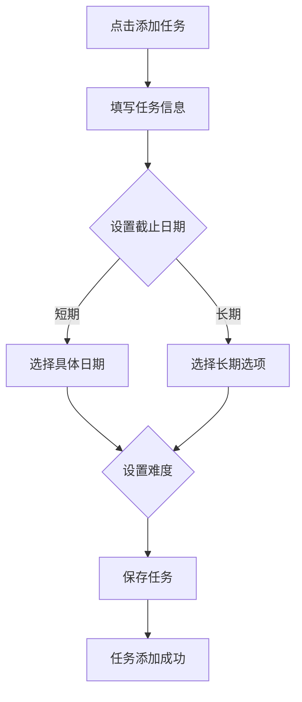
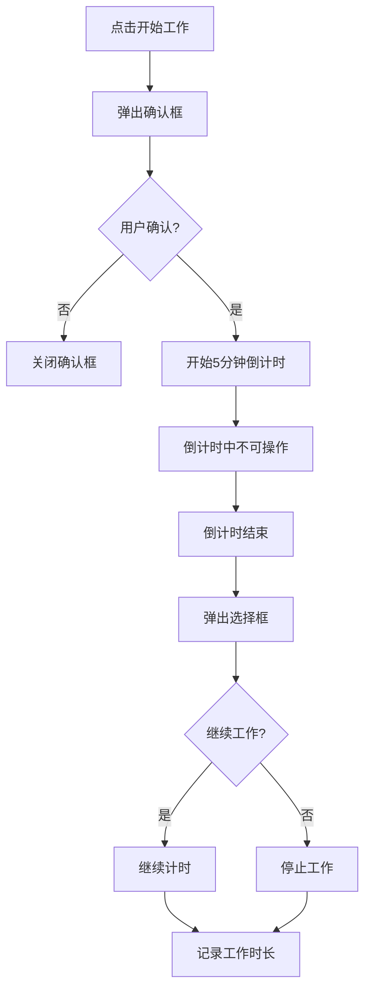
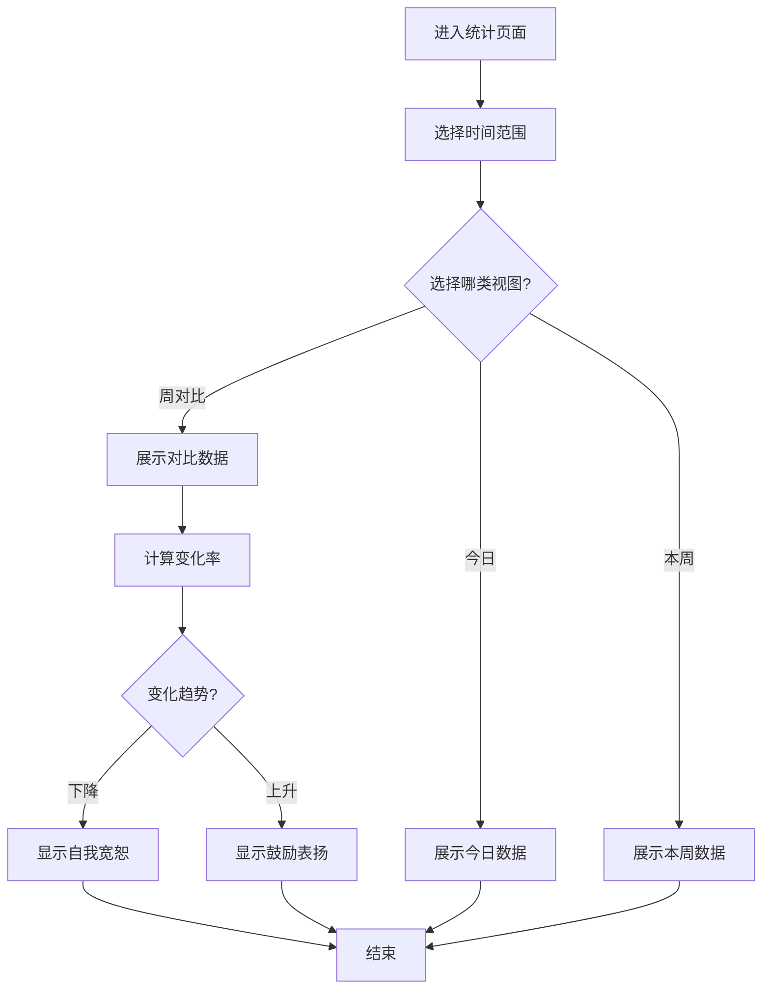

# Do it! 产品原型设计文档

---

## 1. 原型概述

### 1.1 文档目的
本文档详细描述 Do it! 应用的交互原型设计，包括页面布局、交互流程、视觉规范等，为开发团队提供清晰的实现指南。

### 1.2 设计原则
1. **用户中心**: 以用户需求为核心，提供简洁直观的操作体验
2. **心理学导向**: 融入抗拖延心理学原理，设计符合用户行为习惯的交互
3. **视觉一致性**: 保持统一的设计语言和交互模式
4. **响应式设计**: 支持多设备访问，确保良好的移动端体验

---

## 2. 页面原型设计

### 2.1 今日概览页面（Dashboard）

#### 2.1.1 页面布局
```
┌─────────────────────────────────────────────────────────────┐
│  今日概览                           导入任务 │ 添加临时任务  │
│  2024年1月15日 星期一                                        │
├─────────────────────────────────────────────────────────────┤
│  ┌─────────┐ ┌─────────┐ ┌─────────┐                       │
│  │ 今日任务 │ │ 待处理  │ │ 已完成  │                       │
│  │    5    │ │    3    │ │    2    │                       │
│  └─────────┘ └─────────┘ └─────────┘                       │
├─────────────────────────────────────────────────────────────┤
│  ┌───────────────────────────────────────────────────────┐  │
│  │  开始工作                                             │  │
│  │  准备好了吗？先做5分钟试试看！                          │  │
│  │                          [ 开始工作 ]                  │  │
│  └───────────────────────────────────────────────────────┘  │
├─────────────────────────────────────────────────────────────┤
│  今日数据                                                   │
│  ┌───────────────────────────────────────────────────────┐  │
│  │ 工作时长                                              │  │
│  │           2小时30分钟                                  │  │
│  └───────────────────────────────────────────────────────┘  │
├─────────────────────────────────────────────────────────────┤
│  今日待办                                                   │
│  ┌───────────────────────────────────────────────────────┐  │
│  │ [✓] 完成项目文档                                      │  │
│  │ [ ] 回复客户邮件                                      │  │
│  │ [ ] 准备周会PPT                                       │  │
│  └───────────────────────────────────────────────────────┘  │
└─────────────────────────────────────────────────────────────┘
```

#### 2.1.2 交互说明
| 元素 | 交互方式 | 反馈 |
|-----|---------|-----|
| 添加临时任务按钮 | 点击 | 弹出快速添加任务模态框 |
| 导入任务按钮 | 点击 | 打开文件选择对话框 |
| 开始工作按钮 | 点击 | 弹出确认模态框，确认后开始5分钟倒计时 |
| 任务复选框 | 点击 | 切换任务完成状态，带动画效果 |
| 任务项 | 点击 | 打开任务详情模态框 |

#### 2.1.3 5分钟启动确认模态框
```
┌──────────────────────────────┐
│         开始专注工作         │
├──────────────────────────────┤
│  接下来的5分钟，屏幕将被     │
│  完全占用，无法使用手机。    │
│                              │
│  确定要开始吗？              │
├──────────────────────────────┤
│     [ 取消 ]    [ 确认 ]     │
└──────────────────────────────┘
```

---

### 2.2 任务管理页面（Task Management）

#### 2.2.1 页面布局
```
┌─────────────────────────────────────────────────────────────┐
│  任务管理                                   [ 添加任务 ]    │
├─────────────────────────────────────────────────────────────┤
│  ┌──────────┐ ┌──────────┐ ┌──────────┐ ┌──────────┐       │
│  │  全部    │ │  四象限  │ │  按状态  │ │  按难度  │       │
│  └──────────┘ └──────────┘ └──────────┘ └──────────┘       │
├─────────────────────────────────────────────────────────────┤
│                      四象限视图                             │
│  ┌──────────────────┐ ┌──────────────────┐                 │
│  │ 重要且紧急       │ │ 重要不紧急       │                 │
│  │ ○ 任务A         │ │ ○ 任务C         │                 │
│  │ ○ 任务B         │ │ ○ 任务D         │                 │
│  │                 │ │                 │                 │
│  │     2项         │ │     2项         │                 │
│  └──────────────────┘ └──────────────────┘                 │
│  ┌──────────────────┐ ┌──────────────────┐                 │
│  │ 紧急不重要       │ │ 不紧急不重要     │                 │
│  │ ○ 任务E         │ │ ○ 任务F         │                 │
│  │                 │ │                 │                 │
│  │     1项         │ │     1项         │                 │
│  └──────────────────┘ └──────────────────┘                 │
├─────────────────────────────────────────────────────────────┤
│  任务列表                                                   │
│  ┌───────────────────────────────────────────────────────┐  │
│  │ ⚡ 完成项目文档          今天  重要  困难              │  │
│  │ ⏰ 回复客户邮件          今天  重要  中等              │  │
│  │ 📊 准备周会PPT          明天  重要  中等              │  │
│  └───────────────────────────────────────────────────────┘  │
└─────────────────────────────────────────────────────────────┘
```

#### 2.2.2 四象限颜色规范
| 象限 | 名称 | 颜色 | 含义 |
|-----|-----|-----|-----|
| 第一象限 | 重要且紧急 | `#ef4444` (Red) | 需要立即处理 |
| 第二象限 | 重要不紧急 | `#f59e0b` (Amber) | 需要规划处理 |
| 第三象限 | 紧急不重要 | `#3b82f6` (Blue) | 可委托他人 |
| 第四象限 | 不紧急不重要 | `#9ca3af` (Gray) | 可延后处理 |

#### 2.2.3 任务详情模态框
```
┌──────────────────────────────┐
│          任务详情            │
├──────────────────────────────┤
│  标题：完成项目文档          │
│  描述：撰写产品需求文档      │
│                              │
│  重要性：重要                │
│  难度：困难                  │
│  截止日期：2024-01-16        │
│                              │
│  子任务：                    │
│  [✓] 编写概述               │
│  [ ] 编写功能模块           │
│  [ ] 编写用户流程           │
├──────────────────────────────┤
│  [ 编辑 ]  [ 删除 ]  [ 关闭 ]│
└──────────────────────────────┘
```

---

### 2.3 事件记录页面（Timer）

#### 2.3.1 页面布局
```
┌─────────────────────────────────────────────────────────────┐
│  事件记录                                    [ 添加记录 ]    │
├─────────────────────────────────────────────────────────────┤
│  2024年1月15日                                             │
├─────────────────────────────────────────────────────────────┤
│  ┌──┬──┬──┬──┬──┬──┬──┬──┬──┬──┬──┬──┬──┬──┬──┬──┬──┬──┐  │
│  │00│01│02│03│04│05│06│07│08│09│10│11│12│13│14│15│16│17│  │
│  ├──┼──┼──┼──┼──┼──┼──┼──┼──┼──┼──┼──┼──┼──┼──┼──┼──┼──┤  │
│  │  │  │  │  │  │  │  │  │  │██│██│██│  │██│██│  │  │  │  │
│  ├──┼──┼──┼──┼──┼──┼──┼──┼──┼──┼──┼──┼──┼──┼──┼──┼──┼──┤  │
│  │18│19│20│21│22│23│   │   │   │   │   │   │   │   │   │  │
│  ├──┼──┼──┼──┼──┼──┼──┼──┼──┼──┼──┼──┼──┼──┼──┼──┼──┼──┤  │
│  │  │  │  │  │  │  │   │   │   │   │   │   │   │   │   │  │
│  └──┴──┴──┴──┴──┴──┴──┴──┴──┴──┴──┴──┴──┴──┴──┴──┴──┴──┘  │
│  ██ = 工作时间                                              │
├─────────────────────────────────────────────────────────────┤
│  今日记录                                                   │
│  ┌───────────────────────────────────────────────────────┐  │
│  │ ⏰ 09:00-10:30 工作 - 项目文档                        │  │
│  │ ☕ 10:30-10:45 休息                                   │  │
│  │ ⏰ 10:45-12:00 工作 - 客户邮件                        │  │
│  │ 🍛 12:00-13:00 午餐                                   │  │
│  │ ⏰ 13:30-15:00 工作 - 会议准备                        │  │
│  └───────────────────────────────────────────────────────┘  │
└─────────────────────────────────────────────────────────────┘
```

#### 2.3.2 时间线颜色编码
| 类型 | 颜色 | 说明 |
|-----|-----|-----|
| 工作 | `#6366f1` (Indigo) | 专注工作时间 |
| 学习 | `#10b981` (Emerald) | 学习提升时间 |
| 休息 | `#f59e0b` (Amber) | 休息时间 |
| 娱乐 | `#ec4899` (Pink) | 娱乐放松时间 |

#### 2.3.3 添加记录模态框
```
┌──────────────────────────────┐
│         添加时间记录         │
├──────────────────────────────┤
│  开始时间: [ 09:00 ]        │
│  结束时间: [ 10:30 ]        │
│                              │
│  活动类型:                   │
│  ○ 工作  ○ 学习  ○ 休息     │
│  ○ 娱乐  ○ 其他             │
│                              │
│  活动描述: [ ____________ ]  │
├──────────────────────────────┤
│     [ 取消 ]    [ 保存 ]     │
└──────────────────────────────┘
```

---

### 2.4 数据统计页面（Analytics）

#### 2.4.1 页面布局（今日视图）
```
┌─────────────────────────────────────────────────────────────┐
│  数据统计                                                   │
│  查看你的任务完成情况和时间使用统计                          │
│                              今日 │ 本周 │ 周对比          │
├─────────────────────────────────────────────────────────────┤
│  ┌─────────┐ ┌─────────┐ ┌─────────┐ ┌─────────┐          │
│  │ 总任务数 │ │ 完成数  │ │ 待处理  │ │ 专注时长 │          │
│  │    10   │ │    6    │ │    4    │ │ 5h30m   │          │
│  └─────────┘ └─────────┘ └─────────┘ └─────────┘          │
├─────────────────────────────────────────────────────────────┤
│  ┌──────────────────┐ ┌──────────────────┐                 │
│  │ 今日完成任务数   │ │ 任务状态分布     │                 │
│  │                  │ │                  │                 │
│  │        6         │ │    ○○○○○○○○○○   │                 │
│  │      个任务      │ │    ████░░░░░░   │                 │
│  └──────────────────┘ └──────────────────┘                 │
├─────────────────────────────────────────────────────────────┤
│  今日时间记录                                               │
│  ┌───────────────────────────────────────────────────────┐  │
│  │ 工作 (5h30m) ████████████████████████████           │  │
│  │ 休息 (1h)    ██████                                  │  │
│  │ 学习 (30m)   ███                                     │  │
│  └───────────────────────────────────────────────────────┘  │
└─────────────────────────────────────────────────────────────┘
```

#### 2.4.2 页面布局（本周视图）
```
┌─────────────────────────────────────────────────────────────┐
│  数据统计                                                   │
│                              今日 │ 本周 │ 周对比          │
├─────────────────────────────────────────────────────────────┤
│  ┌─────────┐ ┌─────────┐ ┌─────────┐ ┌─────────┐          │
│  │ 总任务数 │ │ 完成数  │ │ 待处理  │ │ 周专注时长│          │
│  │    35   │ │    28   │ │    7    │ │ 32h     │          │
│  └─────────┘ └─────────┘ └─────────┘ └─────────┘          │
├─────────────────────────────────────────────────────────────┤
│  ┌──────────────────┐ ┌──────────────────┐                 │
│  │ 每日完成任务趋势 │ │ 任务时长分布     │                 │
│  │                  │ │                  │                 │
│  │  ████▆▆▆█████   │ │  ████  ███       │                 │
│  │  一 二 三 四 五  │ │  工  学  休  娱  │                 │
│  └──────────────────┘ └──────────────────┘                 │
├─────────────────────────────────────────────────────────────┤
│  任务时长概览                                               │
│  ┌───────────────────────────────────────────────────────┐  │
│  │ 项目文档      ████████████████████  8h                │  │
│  │ 客户沟通      ██████████            4h                │  │
│  │ 学习提升      ██████                2h                │  │
│  └───────────────────────────────────────────────────────┘  │
└─────────────────────────────────────────────────────────────┘
```

#### 2.4.3 页面布局（周对比视图）
```
┌─────────────────────────────────────────────────────────────┐
│  数据统计                                                   │
│                              今日 │ 本周 │ 周对比          │
├─────────────────────────────────────────────────────────────┤
│  ┌─────────┐ ┌─────────┐ ┌─────────┐                      │
│  │ 上周时长 │ │ 本周时长 │ │   变化  │                      │
│  │  28h    │ │  32h    │ │  +14%   │                      │
│  └─────────┘ └─────────┘ └─────────┘                      │
├─────────────────────────────────────────────────────────────┤
│  ┌───────────────────────────────────────────────────────┐  │
│  │            本周与上周对比                              │  │
│  │  ████████          ████████████                      │  │
│  │  上周              本周                              │  │
│  └───────────────────────────────────────────────────────┘  │
├─────────────────────────────────────────────────────────────┤
│  ┌───────────────────────────────────────────────────────┐  │
│  │ 👍 继续加油                                           │  │
│  │ 太棒了！你这周的努力值得肯定，继续保持！               │  │
│  └───────────────────────────────────────────────────────┘  │
└─────────────────────────────────────────────────────────────┘
```

---

### 2.5 日程页面（Calendar）

#### 2.5.1 页面布局
```
┌─────────────────────────────────────────────────────────────┐
│  日程                                       [ + 添加日程 ]  │
│  << 一月 2024 >>                                           │
├─────────────────────────────────────────────────────────────┤
│  日 一 二 三 四 五 六                                      │
│  ┌──┬──┬──┬──┬──┬──┬──┐                                   │
│  │  │  │  │  │  │  │1 │                                   │
│  ├──┼──┼──┼──┼──┼──┼──┤                                   │
│  │2 │3 │4 │5 │6 │7 │8 │                                   │
│  ├──┼──┼──┼──┼──┼──┼──┤                                   │
│  │9 │10│11│12│13│14│15│ ◀── 今日                          │
│  ├──┼──┼──┼──┼──┼──┼──┤                                   │
│  │16│17│18│19│20│21│22│                                   │
│  ├──┼──┼──┼──┼──┼──┼──┤                                   │
│  │23│24│25│26│27│28│29│                                   │
│  ├──┼──┼──┼──┼──┼──┼──┤                                   │
│  │30│31│  │  │  │  │  │                                   │
│  └──┴──┴──┴──┴──┴──┴──┘                                   │
├─────────────────────────────────────────────────────────────┤
│  1月15日 任务                                               │
│  ┌───────────────────────────────────────────────────────┐  │
│  │ ⚡ 完成项目文档          10:00-11:30                   │  │
│  │ ⏰ 回复客户邮件          14:00-15:00                   │  │
│  │ 📊 准备周会PPT          16:00-18:00                   │  │
│  └───────────────────────────────────────────────────────┘  │
└─────────────────────────────────────────────────────────────┘
```

#### 2.5.2 日历颜色编码
| 日期类型 | 背景色 | 说明 |
|---------|-------|-----|
| 工作日 | `#ffffff` | 周一至周五 |
| 周末 | `#f3f4f6` | 周六、周日 |
| 节假日 | `#fef3c7` | 法定节假日 |
| 今日 | `#6366f1` | 当前日期 |
| 有任务 | 根据任务重要性显示 | 红色=紧急重要，黄色=重要不紧急 |

---

## 3. 交互流程图

### 3.1 任务创建流程


### 3.2 5分钟启动流程


### 3.3 数据统计流程


---

## 4. 视觉设计规范

### 4.1 颜色规范
| 颜色类型 | 颜色值 | 使用场景 |
|---------|-------|---------|
| 主色调 | `#6366f1` | 品牌色、主要按钮、选中状态 |
| 成功色 | `#10b981` | 完成状态、正向反馈 |
| 警告色 | `#f59e0b` | 提醒、警告、第二象限 |
| 危险色 | `#ef4444` | 紧急任务、负向反馈、第一象限 |
| 信息色 | `#3b82f6` | 信息展示、第三象限 |
| 中性色 | `#9ca3af` | 次要文字、第四象限 |
| 背景色 | `#f9fafb` | 页面背景 |
| 卡片色 | `#ffffff` | 卡片背景 |

### 4.2 字体规范
| 字体大小 | 用途 | 示例 |
|---------|-----|-----|
| 32px | 页面标题 | "今日概览" |
| 20px | 模块标题 | "今日待办" |
| 16px | 正文 | 任务名称、描述 |
| 14px | 辅助文字 | 时间、标签 |
| 12px | 提示文字 | 占位符、错误提示 |

### 4.3 间距规范
| 间距大小 | 用途 |
|---------|-----|
| 8px | 小间距（元素内部） |
| 16px | 中间距（卡片内边距） |
| 24px | 大间距（模块间距） |
| 32px | 超大间距（页面边距） |

### 4.4 圆角规范
| 圆角大小 | 用途 |
|---------|-----|
| 8px | 小卡片、按钮 |
| 12px | 大卡片、模态框 |
| 16px | 特殊容器 |

---

## 5. 组件清单

### 5.1 通用组件
| 组件名称 | 功能描述 | 位置 |
|---------|---------|-----|
| Button | 按钮组件 | `src/components/Button.tsx` |
| Card | 卡片组件 | `src/components/Card.tsx` |
| Modal | 模态框组件 | `src/components/Modal.tsx` |
| Input | 输入框组件 | `src/components/Input.tsx` |
| Select | 选择器组件 | `src/components/Select.tsx` |

### 5.2 业务组件
| 组件名称 | 功能描述 | 位置 |
|---------|---------|-----|
| TaskCard | 任务卡片 | `src/components/TaskCard.tsx` |
| QuadrantView | 四象限视图 | `src/components/QuadrantView.tsx` |
| TimeLine | 时间线组件 | `src/components/TimeLine.tsx` |
| Chart | 图表组件 | `src/components/Chart.tsx` |
| Calendar | 日历组件 | `src/components/Calendar.tsx` |

---

## 6. 页面路径清单

| 路径 | 页面组件 | 描述 |
|-----|---------|-----|
| `/` | Dashboard.tsx | 今日概览 |
| `/tasks` | TaskList.tsx | 任务列表 |
| `/tasks/:id` | TaskDetail.tsx | 任务详情 |
| `/timer` | Timer.tsx | 事件记录 |
| `/analytics` | Analytics.tsx | 数据统计 |
| `/calendar` | Calendar.tsx | 日程 |
| `/settings` | Settings.tsx | 设置 |